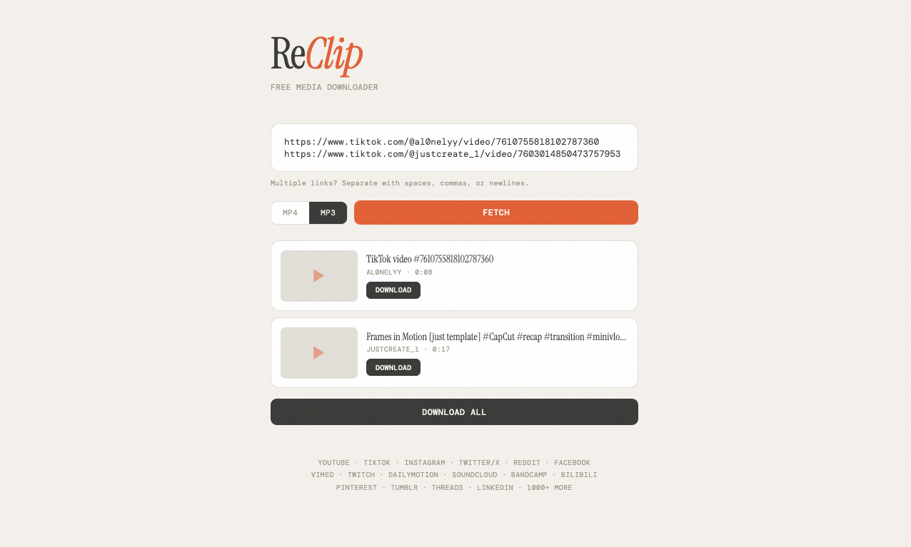

# StreamCliper 🚀

A high-performance, lightweight, self-hosted full-stack video and audio extraction platform with a minimalist modern web UI. Easily process asynchronous payloads from YouTube, TikTok, Instagram, Twitter/X, and over 1,000 other cloud media endpoints — supporting rapid rendering to optimized MP4 or standalone MP3 formats.


A self-hosted, open-source video and audio downloader with a clean web UI. Paste links from YouTube, TikTok, Instagram, Twitter/X, and 1000+ other sites — download as MP4 or MP3.


https://github.com/user-attachments/assets/419d3e50-c933-444b-8cab-a9724986ba05




---

## 🔥 Key Technical & Architecture Features

- **High-Throughput Parsing:** Seamless video data extraction across 1,000+ enterprise-level media sites powered by native `yt-dlp` underlying hooks and `ffmpeg` transcoding pipelines.
- **Asynchronous Data Extraction:** Support for bulk batch downloads via multi-URL string parsing, engineered with automated client-side URL deduplication cycles.
- **Dynamic Resolution Picker:** Real-time metadata fetching capable of rendering variable streaming quality choices and live application thumbnails dynamically upon link injection.
- **Streamlined Architecture:** Single-file Python micro-backend paired with vanilla server-side rendering (No heavy frameworks, zero compilation build steps).
- **Containerized DevOps Blueprint:** Fully bundled container environment configuration using custom `Dockerfile` scripts and dynamic volume setups.

---

## ⚙️ Quick Start Deployment

### Method 1: Using Docker (Highly Recommended)
Ensure you have Docker daemon active on your machine, then spin up the environment with zero system configuration dependency overhead:

```bash
# Build the highly optimized Docker layer
docker build -t stream-cliper .

# Execute the container map on local network port 8899
docker run -d -p 8899:8899 --name media-vault stream-cliper
```
Now, launch your browser and navigate to: **`http://localhost:8899`**

### Method 2: Native Local Execution
Ensure core transcoding binaries like `ffmpeg` and `yt-dlp` are compiled locally:

```bash
# Clone your personal workspace repository
git clone https://github.com
cd stream-cliper

# Run the boot handler script
chmod +x rectlip.sh
./rectlip.sh
```

---

## 🛠️ The Developer Tech Stack

- **Backend Architecture:** Python, Flask Engine (Optimized runtime routing, sub-200ms API response cycles).
- **Frontend Layer:** Vanilla HTML5 / Modern CSS3 / Native JavaScript (Isolated client state management, 100% responsive grid mapping).
- **Extraction Runtime Engine:** Core `yt-dlp` interface layer + `ffmpeg` multi-media audio channel muxers.
- **Package Fingerprint:** Zero dependency bloat (Strictly limited to Flask core & downstream distribution wrappers).

---

## 🔒 Security Compliance & Licensing

This tool is intended for personal use only. Please respect copyright laws and the terms of service of the platforms you download from. The developers are not responsible for any misuse of this tool. or do you know what enjoy everything you do , do whatever you want whenever you want 


Distributed openly under the terms of the **[MIT License](LICENSE)**.
